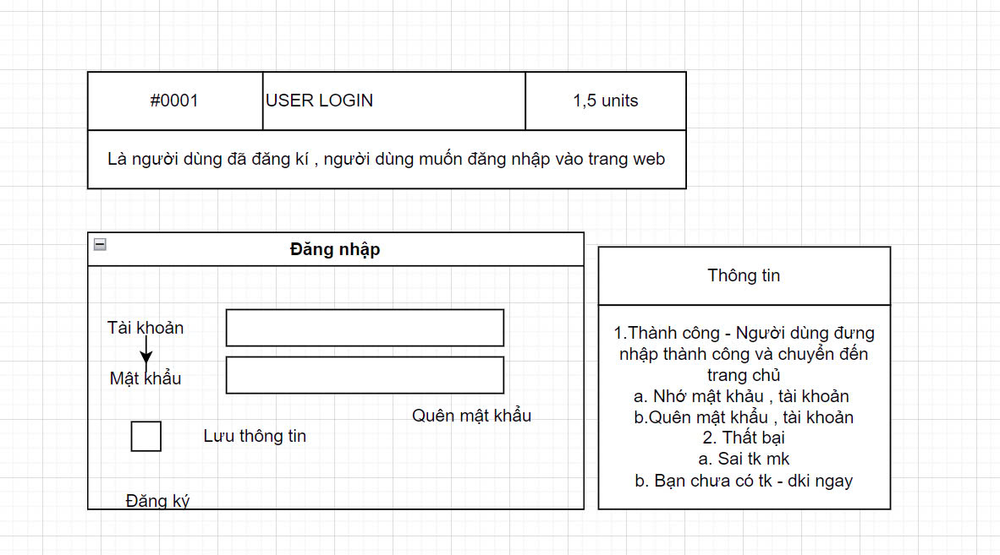
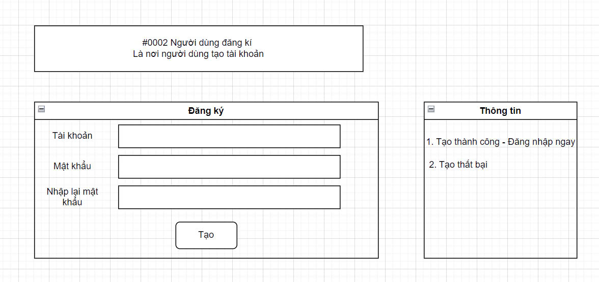
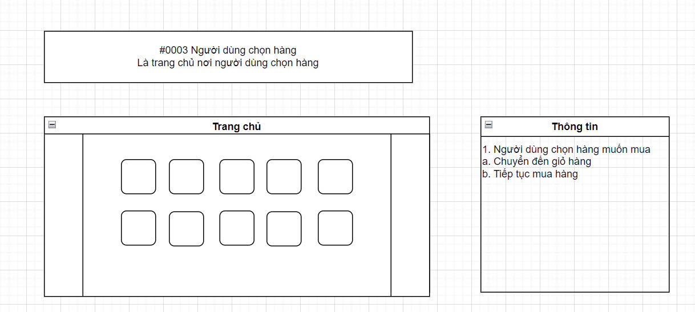
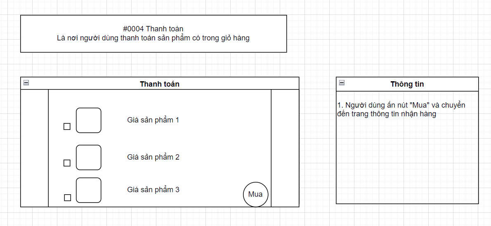
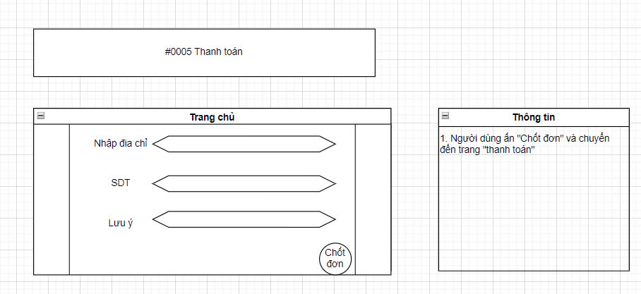

<<<<<<< HEAD
# Webdongho

<!DOCTYPE html>
<html lang="vi">
  <head>
    <meta charset="UTF-8" />
    <meta name="viewport" content="width=device-width, initial-scale=1.0" />
    <link rel="stylesheet" href="styles.css" />
  </head>
  <body>
    <header>
      <h1>Trang Web Bán Đồng Hồ</h1>
    </header>
    <section id="gioi-thieu">
      <h2>Giới thiệu</h2>
      
thành viên

      
Đặng Việt Anh – MSSV: 23010386

      
Nguyễn Quang Huy – MSSV: 23010731

      
Lê Hoàng Hải – MSSV: 23010794

      
Lưu Nguyễn Quang Huy – MSSV: 23010426

      

        Dự án này là một ứng dụng web cho phép người dùng mua sắm đồng hồ trực
        tuyến. Người dùng có thể dễ dàng duyệt các mẫu đồng hồ có sẵn, kiểm tra
        thông tin chi tiết về sản phẩm và thực hiện giao dịch mua hàng một cách
        thuận tiện. Mục tiêu của nền tảng là cung cấp một trải nghiệm mua sắm
        đơn giản và dễ sử dụng cho khách hàng.
      

    </section>
    <section id="tinh-nang">
      <h2>Tính năng</h2>
      <ul>
        <li>
          <strong>Duyệt đồng hồ:</strong> Xem các mẫu đồng hồ có sẵn với thông
          tin chi tiết như thương hiệu, kiểu dáng, và giá cả.
        </li>
        <li>
          <strong>Xem chi tiết sản phẩm:</strong> Kiểm tra thông tin chi tiết về
          từng mẫu đồng hồ, bao gồm mô tả, ảnh sản phẩm và đánh giá từ khách
          hàng.
        </li>
        <li>
          <strong>Mua hàng trực tuyến:</strong> Thực hiện giao dịch mua hàng và
          nhận xác nhận qua hệ thống.
        </li>
        <li>
          <strong>Bảng điều khiển quản trị:</strong> Quản lý sản phẩm, đơn hàng
          và người dùng thông qua giao diện quản trị dễ sử dụng.
        </li>
      </ul>
    </section>
    <section id="cong-nghe">
      <h2>Công nghệ sử dụng</h2>
      <ul>
        <li>
          <strong>Frontend:</strong> HTML, CSS, JavaScript, Bootstrap (cho thiết
          kế đáp ứng)
        </li>
        <li><strong>Backend:</strong> Node.js, Express.js</li>
        <li>
          <strong>Cơ sở dữ liệu:</strong> MongoDB (lưu trữ dữ liệu người dùng và
          thông tin sản phẩm)
        </li>
      </ul>
    </section>
    <section id="cai-dat">
      <h2>Cài đặt</h2>
      <h3>Yêu cầu</h3>
      <ul>
        <li>Đã cài đặt Node.js</li>
        <li>Đã cài đặt và chạy MongoDB</li>
        <li>Đã cài đặt Git</li>
      </ul>
      <h3>Hướng dẫn cài đặt</h3>
      <ol>
        <li>
          Clone repository:
          <a href=""
            >https:</a
          >
        </li>
        <li>Cài đặt các gói phụ thuộc: <code>npm install</code></li>
        <li>
          Tạo file .env để lưu trữ các biến môi trường:
          <pre>
PORT=3000
MONGO_URI=chuoi-ket-noi-mongodb-cua-ban
SESSION_SECRET=chuoi-bao-mat-cho-session
STRIPE_SECRET_KEY=chuoi-khoa-bi-mat-cua-stripe
                </pre
          >
        </li>
        <li>Chạy ứng dụng: <code>npm start</code></li>
      </ol>
    </section>
    <section id="story">
      <h2>Story Example</h2>
      

        
        
        
        
        
      

    </section>
    <section id="su-dung">
      <h2>Sử dụng</h2>
      <ol>
        <li>Truy cập trang web</li>
        <li>Duyệt các mẫu đồng hồ có sẵn.</li>
        <li>Chọn sản phẩm và thực hiện giao dịch mua hàng.</li>
        <li>Xem chi tiết đơn hàng trong bảng điều khiển tài khoản của bạn.</li>
      </ol>
    </section>
    <section id="dong-gop">
      <h2>Đóng góp</h2>
      

        Chúng tôi rất hoan nghênh các đóng góp! Vui lòng đọc
        <a href="guidelines.html">Hướng dẫn đóng góp</a> để biết cách bắt đầu.
      

    </section>
    <section id="giay-phep">
      <h2>Giấy phép</h2>
      

        Dự án này được cấp phép theo <a href="LICENSE">Giấy phép MIT</a>. Xem
        tệp LICENSE để biết thêm chi tiết.
      

    </section>
    <section id="lien-he">
      <h2>Liên hệ</h2>
      

        Nếu bạn có bất kỳ câu hỏi hoặc đề xuất nào, vui lòng liên hệ với chúng
        tôi qua email tại
        <a href="mailto:23010865@st.phenikaa-uni.edu.vn"
          >23010865@st.phenikaa-uni.edu.vn</a
        >.
      

    </section>
    <footer>
      
&copy; 2025 Trang Web Bán Đồng Hồ. Tất cả quyền được bảo lưu.

    </footer>
  </body>
</html>
=======
# shop_dongho
>>>>>>> a194f29accddf051c6bc9922749172965a585d35
